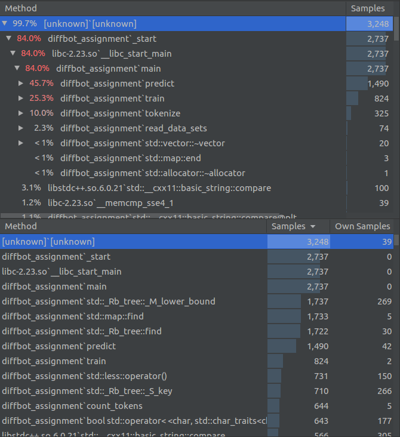

# Diffbot Gender Classification by Name Assignment
By: Daniel Sim - Senior Data Scientist @Elsevier, London

dannie.sim@gmail.com

15th February 2020

## Methodology
A Naive-Bayes model is implemented here for training and evaluation of gender classification by name. Naive-Bayes is
relatively simple to implement and debug and is a good fit for simple text classification tasks. 

C++14 is used largely due to the author's familiarity with it, and to a lesser degree - to showcase execution speed
and efficiency compared to Python and to a lesser extent Java. Java was considered first as the language of choice,
however, the author has not programmed in Java for years hence the fallback to C++14.

It is noted that C++ programs have faster load times and takes significantly less memory compare to a Java program which
requires a JVM. This can be advantageous in certain map-reduce/on-cluster jobs.

BPE (Binary Pair Encoding) and SentencePiece subword tokenizers were considered to increase classification
performance. However, the goal of > 95% accuracy on the test set was achieved with a simpler subword scheme explained
below:
- Create subword n-grams from the start and end of the first X words of a name.
  (X = 1 was used as it gave the best accuracy)
- Min and Max n-gram length are model hyper-parameters set to 2 and 10 respectively. If the word is shorter than those
lengths, subword creation stopped when the subword length is length-1 of the word.
- subwords created from the front are prefixed with "#" to distinguish them from full words. Likewise,
 subwords created from the back are post-fixed with "#".
- The original words in the full name are then added to the subwords.
 
 For example, "aloiskonstantin 9th prince of löwensteinwertheimrosenberg" becomes:
"#al", "in#", "#alo", "tin#", "#aloi", "ntin#", "#alois", "antin#", "#aloisk", "tantin#", "#aloisko", "stantin#",
"#aloiskon", "nstantin#", "#aloiskons", "onstantin#", "#aloiskonst", "konstantin#", "aloiskonstantin", "9th",
"prince", "of", "löwensteinwertheimrosenberg"

It is interesting to note that when the original words of the full name are not added accuracy falls from 95.4266% to
95.1467%.
 
 ## Performance Profiling
 On the author's PC (Intel i5 3.4 GHz, SSD and with -O3 compiler optimization) takes under 2 seconds for the complete
 run which includes:
 - Loading the training and test data sets (99,999 rows)
 - Tokenization and cleaning to create feature column
 - Training the model (With 79,992 rows marked as "Train")
 - Evaluate and output results of training and test sets
 
 The speed of execution made it very quick to tweak hyper-parameters and try out different variations of algorithms
 involved.
 
 ### Profiler Call Tree
 
 
 Each sample represents ~1ms of execution.
 
 For training and prediction, the bulk of the execution time goes to std::map::find which is a dictionary lookup.
 
 Generating subwords took 50% of the time during tokenization. Tokenization itself just represents ~10% of the total
 execution time of the program.

## Usage
Takes `data/allnames.tsv` as input and outputs classification in:
- `data/train_predict.tsv`
- `data/test_predict.tsv`

Basic classification accuracy metrics are given through stdout.

Program parameters and hyper-parameters are found and documented at the top of `main.cpp` and can be modified
accordingly.

## Build and Run
Developed on:
- Ubuntu 16.04
- CLion 2019.3
- CMake 3.15.3
- g++ 5.4.0

Requires a compiler that supports the C++14 standard. Also tested on macOS Mojave 10.14 with Xcode 11.3.

```
# Build program
mkdir cmake-build
cd cmake-build
cmake ..
make

# Run program, it expects the input file to be in ../data
./diffbot_assignment
```
